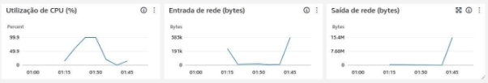
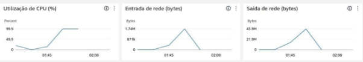

_DEPARTAMENTO DE CIÊNCIAS DE COMPUTAÇÃO E ESTATÍSTICA DISCIPLINA: Sistemas Distribuídos - 1972SCC_

### <center>17/06/2024</center>

# Algoritmos de Ordenação em Grandes Conjuntos de Dados

<table>
  <tr>
    <td align="center">
      <a href="https://github.com/heitorabreu">
        <br>
        <sub>
          <b>Heitor Xavier</b>
        </sub>
      </a>
    </td>
    <td align="center">
      <a href="https://github.com/Lucas-S-Y">
        <br>
        <sub>
          <b>Lucas Shinji</b>
        </sub>
      </a>
    </td>
    <td align="center">
      <a href="https://github.com/vesrozeno">
        <br>
        <sub>
          <b>Vitor Rozeno</b>
        </sub>
      </a>
    </td>
  </tr>
</table>

<hr>

## <center>SUMÁRIO</center>

1. [Algoritmos de Ordenação](#_page2_x72.00_y72.00)
2. [Insertion Sort](#_page2_x72.00_y375.36)
3. [Selection Sort](#_page3_x72.00_y87.87)
4. [Quick Sort](#_page3_x72.00_y472.01)
5. [Merge Sort](#_page4_x72.00_y286.68)
6. [Comparação Entre os Algoritmos](#_page5_x72.00_y254.94)
7. [Sistemas Distribuídos e AWS](#_page5_x72.00_y524.87)
   1. [Sistemas Distribuídos](#_page6_x72.00_y72.00)
   2. [AWS](#_page6_x72.00_y541.08)
8. [Metodologia](#_page7_x72.00_y119.67)
9. [Métricas de Elasticidade da Plataforma](#_page7_x72.00_y236.74)
10. [Insertion Sort com 100 mil números](#_page7_x72.00_y497.97)
11. [Quick Sort com 10 milhões de números](#_page8_x72.00_y90.51)

## 1. Algoritmos<a name="_page2_x72.00_y72.00"></a> de Ordenação

A ordenação é uma operação fundamental em problemas da ciência da computação, sua utilização está presente em diversas aplicações, como a organização de bancos de dados e a otimização de processos de pesquisa. É fundamental que algoritmos de ordenação sejam eficientes, ainda mais quando o volume de dados é extremamente grande. Este trabalho visa explorar o comportamento de algoritmos de ordenação quando utilizado em um ambiente de sistema distribuído, neste caso, as instâncias _ec2_ do ambiente da _AWS - Amazon_.

Em alguns casos, é importante que o algoritmo possua estabilidade. Isto é, o algoritmo deve preservar a ordem relativa de elementos que possuem chaves idênticas. Por exemplo, um algoritmo estável, quando se depara com dois elementos que possuem a mesma chave, as suas ordens relativas são mantidas após o processo de ordenação. A estabilidade é importante em muitos casos, mas de maneira mais contundente em casos que a ordenação é múltipla, e com ordenações em sequência, em que os critérios são diferentes, fazendo com que as ordenações subsequentes não interfiram na ordem estabelecida pelas ordenações anteriores.

Nas subseções seguintes iremos discorrer sobre os algoritmos que selecionamos para testarmos em nosso trabalho.

## 2. Insertion<a name="_page2_x72.00_y375.36"></a> Sort

O Insertion Sort, como o nome sugere, pega o elemento e insere-o na sua posição correta, tomando em conta os elementos já ordenados. Este algoritmo foi utilizado como base para o Shell Sort, que possui complexidade e desempenho melhores.

Sua complexidade é:

- **Ο(n)** no melhor caso (lista já ordenada);
- **Ο(n2)** no caso médio e no pior caso.

Implementação em _python_:

```python
def insertion_sort(arr):

for i in range(1, len(arr)): key = arr[i]

j = i-1

while j >= 0 and key < arr[j]:

arr[j + 1] = arr[j]

j -= 1

arr[j + 1] = key

return arr
```

## 3. Selection<a name="_page3_x72.00_y87.87"></a> Sort

Este algoritmo divide a lista em duas — a sub-lista de itens já ordenados, e a sub-lista de itens não ordenados. Realiza iterações selecionando o menor elemento da sub-lista desordenada e move-o para a sub-lista ordenada.

Sua complexidade é:

- **Ο(n2)** em todos os casos.

Implementação em _python_:

```python
def selection_sort(arr):

for i in range(len(arr)):

min_idx = i

for j in range(i+1, len(arr)):

if arr[j] < arr[min\_idx]:

min_idx = j

arr[i], arr[min\_idx] = arr[min\_idx], arr[i] return arr
```

## 4. Quick<a name="_page3_x72.00_y472.01"></a> Sort

O Quick Sort é um dos mais eficientes algoritmos de ordenação, este utiliza a estratégia “dividir para conquistar”. Seu funcionamento baseia-se na seleção de um “pivô”, o particionamento da lista em dois sub-conjuntos — elementos menores que o pivô, e elementos maiores — e então ordena recursivamente os sub-conjuntos de dados.

Sua complexidade é:

- **Ο(nlog n)** no melhor caso e no caso médio;
- **Ο(n2)** no pior caso (quando o pivô é o menor ou o maior elemento de cada partição) .

Implementação em _python_:

```python
def quick_sort(arr):

if len(arr) <= 1:

return arr

pivot = arr[len(arr) // 2]

left = [x for x in arr if x < pivot]

middle = [x for x in arr if x == pivot]

right = [x for x in arr if x > pivot]

return quick_sort(left) + middle + quick_sort(right)
```

## 5. Merge<a name="_page4_x72.00_y286.68"></a> Sort

O Merge Sort também utiliza a estratégia de “dividir para conquistar”. Este divide a lista em duas metades, ordena cada partição de maneira recursiva e então combina, faz o _merge_, as duas metades ordenadas.

Sua complexidade é:

- **Ο(nlog n)** no melhor caso, no caso médio e no pior caso.

Ele é um algoritmo estável, então sua utilização em casos onde a estabilidade é necessária é grande. Também é amplamente utilizado para ordenar arquivos grandes que não cabem na memória.

Implementação em _python_:

```python
def merge_sort(arr):

if len(arr) <= 1:

return arr

mid = len(arr) // 2

left = merge_sort(arr[:mid]) right = merge_sort(arr[mid:]) return merge(left, right)

def merge(left, right):

result = []

i = j = 0

while i < len(left) and j < len(right): if left[i] < right[j]:

result.append(left[i]) i += 1

else:

result.append(right[j])

j += 1 result.extend(left[i:]) result.extend(right[j:]) return result
```

## 6. Comparação<a name="_page5_x72.00_y254.94"></a> Entre os Algoritmos

| **Algoritmo**  | **Melhor complexidade** | **Média complexidade** | **Pior complexidade** | **Estabilidade** |
| -------------- | :---------------------- | :--------------------- | :-------------------- | ---------------- |
| Insertion Sort | Ο(n2)                   | Ο(n2)                  | Ο(n2)                 | Sim              |
| Selection Sort | Ο(n)                    | Ο(n2)                  | Ο(n2)                 | Não              |
| Quick Sort     | Ο(nlog n)               | Ο(n log n)             | Ο(n2)                 | Não              |
| Merge Sort     | Ο(nlog n)               | Ο(nlog n)              | Ο(nlog n)             | Sim              |

## 7. Sistemas<a name="_page5_x72.00_y524.87"></a> Distribuídos e AWS

O advento da computação em nuvem e a utilização de sistemas distribuídos revolucionou e revoluciona a maneira das organizações gerenciarem, processarem e armazenarem dados. A _Amazon Web Services (AWS)_ foi a plataforma de computação em nuvem escolhida para a realização deste projeto. É a principal plataforma de serviços na nuvem no mercado, e oferece diversos serviços e ferramentas que possibilitam a construção e operação de sistemas distribuídos. Neste capítulo iremos explorar conceitos de sistemas distribuídos e ferramentas da _AWS_ que são úteis para implementação destes sistemas.

### 1. Sistemas<a name="_page6_x72.00_y72.00"></a> Distribuídos

Um SD (Sistema Distribuído) é um conjunto de computadores independentes que se mostra ao usuário como um sistema único e coerente. A distribuição de componentes de software e hardware entre inúmeros dispositivos é o que caracteriza estes sistemas. Algumas das características que estão recorrentemente presentes em SDs são:

- **Escalabilidade:** refere-se à capacidade de aumentar a carga de trabalho de maneira eficiente;
- **Confiabilidade:** as operações são contínuas mesmo quando falhas em componentes individuais ocorrem;
- **Heterogeneidade:** tipos diversos de hardware e software são integrados com funcionamento coerente;
- **Transparência:** o usuário não enxerga a complexidade do SD, enxerga-o apenas como uma unidade única.

Os SDs destacam-se por possuírem um grande desempenho, devido à utilização de processamento paralelo e de distribuição de carga. Também possuem grande capacidade de escalabilidade, pois novos recursos podem ser adicionados de maneira ágil e eficiente. A confiabilidade dos SDs é fundamental, através da redundância e replicação dos dados, a chance de ocorrer perda de dados é muito baixa. Por fim, estes são muito flexíveis, podendo moldar-se de acordo com a demanda de trabalho.

Diversos desafios notáveis se apresentam à manutenção dos SDs, de modo que estes devem ser tratados com astúcia para garantir o bom funcionamento do SD. A complexidade é um grande obstáculo, uma vez que, devido à característica distribuída, a coordenação dos componentes espalhados ao longo da rede é necessária. A consistência dos dados é fundamental, visto que todos os nós do sistema devem possuir a mesma visão sobre os dados, os desafios para isto são a latência e a falta de sincronização instantânea.

### 2. AWS

<a name="_page6_x72.00_y541.08"></a>A _AWS_ possui uma infraestrutura robusta e serviços que podem ser utilizados baseando-se em sistemas distribuídos. Alguns dos serviços que a plataforma oferece são:

- **Amazon EC2 (Elastic Compute Cloud):** Este serviço permite que sejam utilizados computadores virtuais para a execução de aplicações. Ao utilizar o EC2, é possível selecionar a localização geográfica da instância;
- **AWS Lambda:** Este é um serviço orientado a eventos, responsável por executar códigos e gerenciar de maneira automática os recursos que esse código exige;
- **Amazon S3 (Simple Storage Service):** É um serviço de armazenamento que armazena objetos. Podendo ser armazenados tipos muito variados de dados;
- **Amazon CloudWatch:** Este serviço possibilita com que diversas métricas sejam observadas pelo usuário através de _dashboards._ O usuário pode observar métricas como processamento, memória, operações no disco, rede e outras.

## 8. **Metodologia**

<a name="_page7_x72.00_y119.67"></a>Neste trabalho, a plataforma da AWS escolhida foi a EC2 (tipo de instância t2.micro). Nesta fizemos a execução de algoritmos de ordenação. Optamos por executar o Insertion Sort com 100 mil números e o Quick Sort com 10 milhões de números. Ao fim, medimos métricas de Utilização de CPU, Entrada da rede e Saída da rede (em bytes).

## 9. Métricas<a name="_page7_x72.00_y236.74"></a> de Elasticidade da Plataforma

Selecionamos duas principais métricas, o tempo entre o desligamento e a inicialização de uma nova instância EC2 e tempo entre a inicialização e conclusão da nova instância EC2 na substituição de uma instância EC2 antiga num grupo de Autoscaling.

| **Métrica**                              | **Tempo Médio (s)** |
| ---------------------------------------- | ------------------- |
| Tempo entre desligamento e inicialização | 2                   |
| Tempo entre inicialização e conclusão    | 30                  |

Assim, podemos visualizar que o tempo total médio entre o desligamento entre uma instância e a conclusão da configuração de uma nova a fim de substituí-la em casos de não-integridade (na configuração do grupo de destino) é de 32 segundos.

## 10. Insertion<a name="_page7_x72.00_y497.97"></a> Sort com 100 mil números



Aqui, tivemos uma ocupação da CPU muito próxima de 100%, e taxas de entrada da rede de 383kB e taxa de saída de 15.4MB.

## 11. Quick Sort com 10 milhões de números



<a name="_page8_x72.00_y90.51"></a>Neste outro caso, também tivemos taxas de ocupação da CPU muito próximas de 100%, e taxas de entrada da rede em 1.74MB e de saída de 43.9MB.
